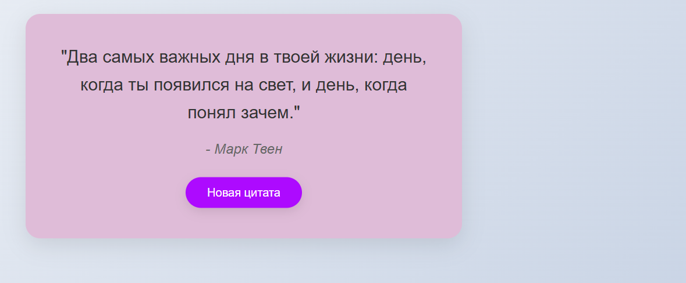
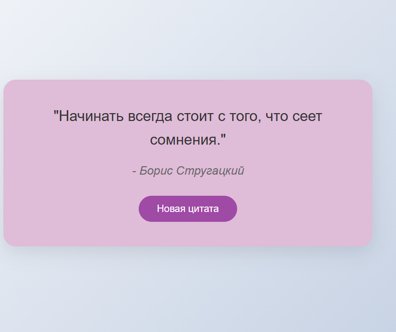
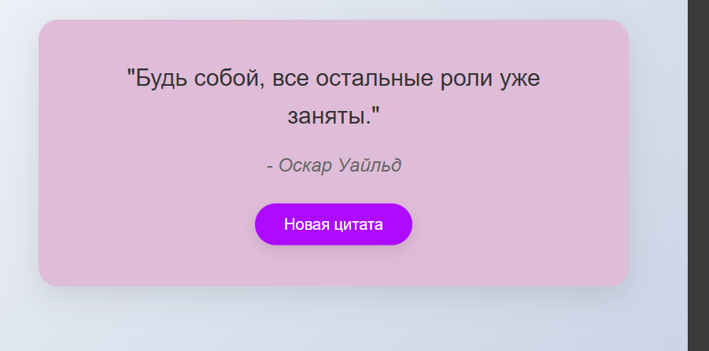

# Контрольная работа №4
## Демина Екатерина Андреевна, ЭФБО-04-24
### Вариант №3 "Генератор случайных цитат - вывод случайной цитаты по кнопке "
## Демонстрация работы приложения в скриншотах

## Функциональность
### 1.  Показ случайной цитаты при загрузке

### 2. Обновление цитаты по кнопке "Новая цитата"

### 3. Классный дизайн
## Ссылка на репозиторий
https://github.com/Plovika/kr4_TIP
